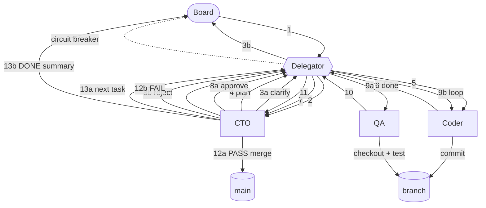

# Agent Pipeline Workflow

This document is the source of truth for how AI agents collaborate on this repository. Five distinct roles operate through a central **Delegator** that routes structured `HANDOFF` blocks between agents. The goal is a deterministic, auditable pipeline where every transition is recorded as an issue comment, every loop has a circuit breaker, and no single agent is making judgment calls outside its defined scope. Humans (the Board) interact only at the start (intake) and end (completion) of each feature, plus when the circuit breaker fires.

## Agents and Roles

- **Board** (human): Creates parent issues describing features. Answers clarifying questions during intake. Receives final summary on completion. Reviews and resolves any pipeline pause caused by the circuit breaker.
- **Delegator** (local Qwen model): Pure switchboard. Parses `HANDOFF` blocks in issue comments, routes payloads to the target agent, and tracks consecutive round-trip counts per agent pair. Pauses the issue and notifies Board when a threshold is breached. **Never makes judgment calls** — does not interpret content, does not modify text below the `---` separator, does not decide whether work is "good enough."
- **CTO** (Claude Code adapter): Reviews feature requests with pushback when scope is unclear. Writes the `ACCEPTANCE CRITERIA` block during intake. Plans work into child issues. Reviews code diffs (approve/reject). Merges approved branches to main and deletes them. Tracks completion against the acceptance criteria and writes the final summary.
- **Coder** (Cursor adapter): Implements work on a feature branch (`feat/BIZ-N-short-description`). Runs smoke tests locally if the change affects server startup. **Commits to the feature branch only — never to main.** Hands off to CTO for review when the implementation is ready.
- **QA** (Cursor adapter): Checks out the feature branch, runs the Playwright suite, reports `PASS` or `FAIL` with logs. **Does not commit. Ever.** Read-only role.

## Workflow Diagram



### Step Legend

- **1**: Board files a parent issue describing a feature, with a `HANDOFF` block targeting `CTO`.
- **2**: Delegator reads the parent issue's `HANDOFF` block and forwards the request to the CTO adapter.
- **3a / 3b** (clarify path): If the request is ambiguous or under-scoped, CTO writes a `HANDOFF` to Board with `next_action: clarify`. Delegator forwards (3b) the questions back to Board, who answers and re-fires step 1. Loop until aligned.
- **4**: CTO accepts the request, writes the `ACCEPTANCE CRITERIA` block on the parent issue, plans the first child issue, and hands off to Coder via `next_action: implement`.
- **5**: Delegator routes the implementation request to Coder, including the child issue context and branch name (`feat/BIZ-N-...`).
- **6**: Coder commits work to the feature branch and hands back to CTO via `next_action: review`. Coder does NOT push to main.
- **7**: Delegator forwards the review request to CTO.
- **8a / 8b**: CTO runs `git diff` against main, evaluates the change. **8a** (approve) hands off to QA. **8b** (reject) hands back to Coder with feedback in the context section.
- **9a / 9b**: Delegator routes accordingly — to QA on approve, back to Coder on reject (this is where the Coder↔CTO loop count increments).
- **10**: QA checks out the branch, runs `npm run test:list`, and hands off to CTO with a `PASS` or `FAIL` summary plus log excerpts.
- **11**: Delegator forwards the QA result to CTO.
- **12a** (PASS path): CTO merges the feature branch into main, deletes the branch (local + remote), and re-reads the `ACCEPTANCE CRITERIA` block.
- **12b** (FAIL path): CTO writes a `HANDOFF` back to Coder (or escalates to Board if the failure is out of scope). Delegator forwards.
- **13a / 13b**: After PASS + merge, CTO either plans the next child issue (13a — back through step 4) or, if all acceptance criteria are satisfied, writes the final summary and closes the parent (13b — `HANDOFF` to Board with `next_action: close`).
- **Circuit breaker (dotted)**: At any point, if the Delegator detects a threshold breach on consecutive round trips between two agents, it pauses the issue and notifies Board out-of-band.

## HANDOFF Block Schema

Every transition between agents is encoded as a `HANDOFF` block appended as an issue comment. The block has a structured header that the Delegator parses, a `---` separator, and a free-form context section that the Delegator copies verbatim into the next issue's description (or comment) without parsing.

````markdown
## HANDOFF
target_agent: CTO|Coder|QA|Board
next_action: review|implement|test|clarify|close|escalate
issue_ref: BIZ-N
branch: feat/BIZ-N-description (or "none")
loop_count: 0 (increments on each round trip between same agent pair)
summary: one-line status description
blocker: none | brief blocker description

---

[Full context below: description for next agent, verbatim quotes, diff summaries, test logs. Delegator copies this section verbatim into the next issue's description.]
````

### Field reference

- `target_agent`: One of `CTO`, `Coder`, `QA`, `Board`. Anything else is rejected by the Delegator.
- `next_action`: The intent verb — `review`, `implement`, `test`, `clarify`, `close`, `escalate`. The Delegator uses this to validate the routing makes sense for the target (e.g. `test` only goes to QA).
- `issue_ref`: The Paperclip issue ID, e.g. `BIZ-9`. Used for round-trip tracking and to scope branch names.
- `branch`: The feature branch the work lives on, or `none` if no branch exists yet (intake / planning phase).
- `loop_count`: Integer counter. The Delegator increments this when the same source→target pair handoff repeats consecutively. The originating agent does not need to compute this — Delegator overwrites the field on routing. **It is included in the schema so the next agent can see how deep the loop is.**
- `summary`: One line. Renders as the comment subject line in dashboards.
- `blocker`: `none` if work can proceed, otherwise a brief description. A non-`none` blocker MUST be paired with `next_action: clarify` or `escalate`.

### The `---` separator

The triple-dash on its own line marks the end of the structured header and the start of the free-form context. **The Delegator only parses content above the separator.** Everything below is passed through untouched — verbatim quotes, diff blocks, test output, screenshots referenced by URL, prose context for the next agent. This means agents can put anything they need to share below the separator without worrying about breaking the parser.

## Acceptance Criteria Protocol

The CTO writes a single `ACCEPTANCE CRITERIA` block as a comment on the parent issue **during intake, before any code is written**. This block is the contract between Board and the pipeline. It is the only thing CTO checks against when deciding whether the parent issue is done.

- The block is a checklist of testable statements. Each item must be objectively verifiable — "site loads fast" is bad, "GET /api/health returns 200 in <500ms p95" is good.
- After every QA `PASS`, CTO re-reads the criteria block and updates the checkboxes for items the most recent merge satisfied.
- When **every** item is checked, CTO writes a one-paragraph summary comment on the parent, closes all child issues, closes the parent, and writes a final `HANDOFF` to Board with `next_action: close`.
- If a child PR satisfies criteria CTO had not anticipated, CTO may add new criteria items only with explicit Board approval (round-trip via `clarify`).

### Example

```markdown
## ACCEPTANCE CRITERIA
- [ ] GET /api/X returns 200 with JSON array of shape {...}
- [ ] Frontend page Y loads without console errors
- [ ] Playwright test added for new route, passing
```

## Branch Conventions

- Branch name format: **`feat/BIZ-N-short-description`** where `N` is the Paperclip issue number and `short-description` is 2–4 hyphenated lowercase words.
- **One branch per child issue.** If a child issue grows beyond a single coherent change, CTO splits it into a new child issue (and a new branch) rather than expanding the existing branch.
- **Coder commits go to the feature branch only.** Coder must never push to main.
- **CTO is the only agent that merges.** CTO uses `git merge --no-ff` (or `git merge`, project preference) into main, pushes, then deletes the branch on origin and locally:
  ```bash
  git push origin --delete feat/BIZ-N-...
  git branch -d feat/BIZ-N-...
  ```
- Commit messages reference the issue ID: `feat: implement X per BIZ-9`.

## Circuit Breaker Rules

The Delegator maintains a counter for each ordered pair of agents (source → target). The counter increments when consecutive handoffs flow between the same pair on the same issue. It resets when a different agent appears in the chain.

| Loop                       | Threshold | Typical cause                              |
|----------------------------|-----------|--------------------------------------------|
| Coder ↔ CTO (code review)  | 5         | Implementation diverging from plan         |
| CTO ↔ QA                   | 3         | Flaky tests, environmental issues          |
| Board ↔ CTO (intake)       | 3         | Underspecified or contested feature scope  |

### Behavior on breach

1. Delegator stops routing on the affected issue.
2. Delegator posts a `## CIRCUIT BREAKER` comment on the parent issue with the loop name, threshold, and last 3 handoffs in chronological order.
3. Delegator notifies Board out-of-band (Paperclip notification).
4. The issue is paused — no agent will accept further handoffs on this issue until manually un-paused.

### Un-pausing

Un-pausing requires human review. Board (or a designated human reviewer) reads the breach context, decides on a corrective action, and either:

- Edits the parent issue's status field to `unpaused` (Delegator picks this up on next poll and resets the counter), **or**
- Closes the issue if the work is no longer needed.

There is no automatic timeout — paused stays paused until a human acts.

## Completion Protocol

The CTO is responsible for closing parent issues. The protocol runs on **every QA PASS** for any child of the parent:

1. CTO merges the feature branch to main and deletes it (see Branch Conventions).
2. CTO re-reads the `ACCEPTANCE CRITERIA` block on the parent issue.
3. CTO updates checkboxes for any items the most recent merge satisfies.
4. **If any item remains unchecked**: CTO plans the next child issue (re-enter the workflow at step 4 in the diagram).
5. **If every item is checked**:
   - CTO writes a one-paragraph summary comment on the parent issue describing what shipped and pointing at the merge commits.
   - CTO closes all child issues with a comment referencing the parent.
   - CTO closes the parent issue.
   - CTO writes a final `HANDOFF` block targeting Board with `next_action: close`. Delegator forwards this as the closing notification.
